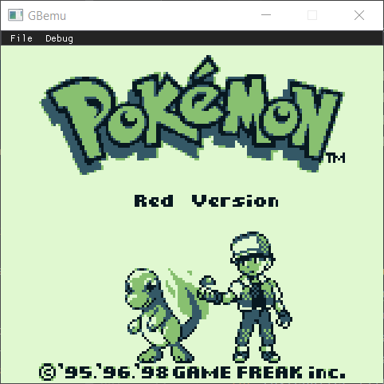
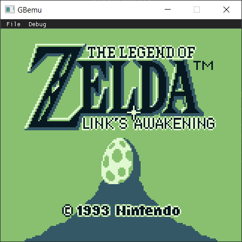
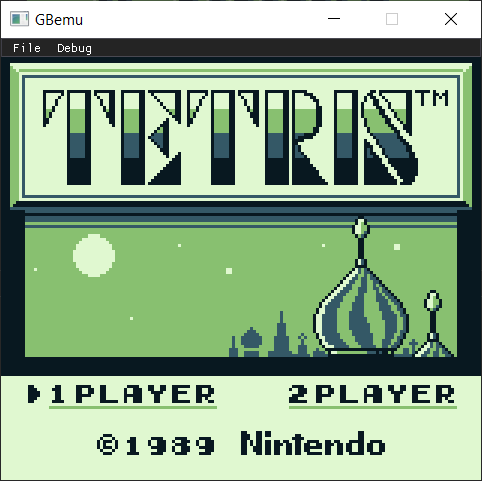
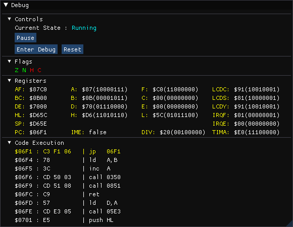
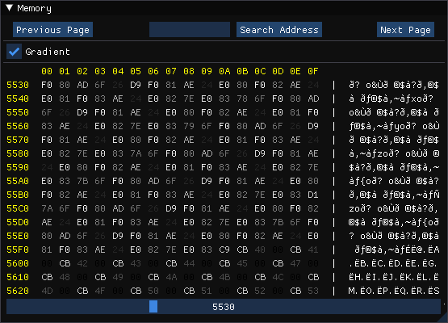
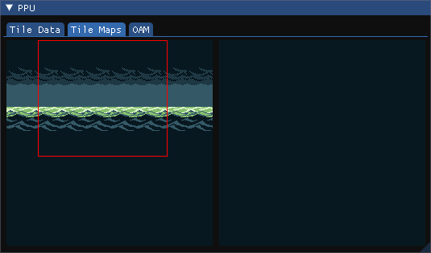
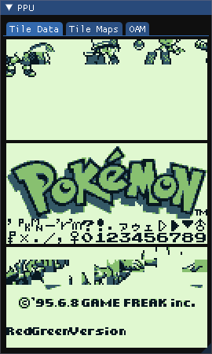
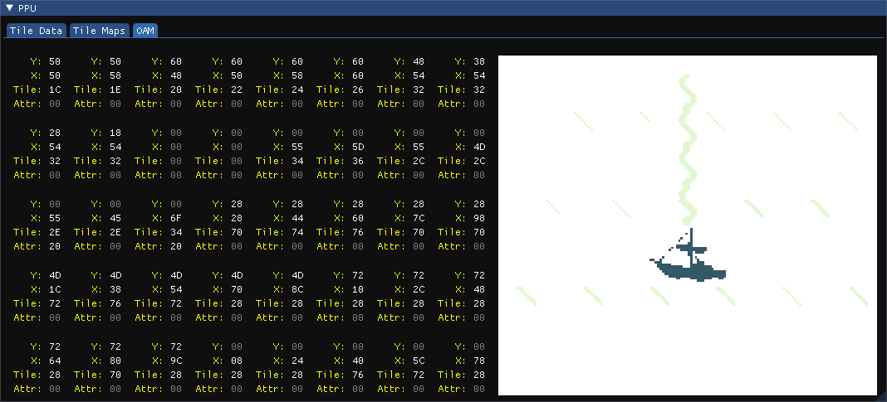
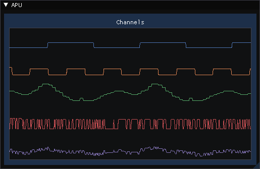

# GBemu

> An experimental Gameboy Emulator written in Java

|  |  |  |  |
|---|---|---|---|
|||||


---

## Table of Contents

- [Features](#features)
- [Screenshots](#screenshots)
- [Libraries](#libraries)
- [Roadmap](#roadmap)
- [Resources](#resources)
- [License](#license)

---

## Features
### Core
* CPU Emulation with decompiler and debugger (with execution and memory breakpoints)
* PPU Emulation
* APU Emulation with 2 Pulse Channels, a Wave Channel and a Noise Channel (no stereo output yet)
* Persistent RAM when supported by the cartridge
* Basics Memory Bank Controllers:
    - [NoMBC](https://gbdev.io/pandocs/nombc.html) : Fully implemented
    - [MBC1](https://gbdev.io/pandocs/MBC1.html) : Multigame Cartridges not supported yet
    - [MBC3](https://gbdev.io/pandocs/MBC3.html) : RTC capability not tested yet
    
### User Interface

#### Main Window
- Load a ROM
- Pause / Resume emulation
- Reset the emulator

#### Debug Window
- Enter step by step code execution
- Display flags and CPU registers (as 8bit and merge as 16bit)
- Display the current code execution

#### Memory Window
- Display one page of memory (256 bytes)
- Search for a specified address
- Display RAW memory as ASCII and hexadecimal
- Display RAM with color gradient to help spot patterns

#### PPU Window
- Display the 2 tilemaps and current viewport
- Display the tileset
- Display OAM as list and as a rendered layer

#### APU Window
- Display waveforms of all Audio Channels and the master DAC

#### Serial Window
- Display the serial output of the Gameboy as a String

#### Console Window
- Display emulator information (Emulation reset, Breakpoint reached ...)
- Enabled user to enter commands (for now just 'help' and breakpoints)
  
---

## How to Use
### Launch
To launch the Emulator set the Main Class to ```Main.java```

/!\ For now the current audio output is hardcoded at line 29, you may need to change it /!\
  
---

## Screenshots
| CPU |
|-----|
||

| PPU |
|-----|
||
||

| APU |
|-----|
||


| I/O |
|-----|
||

---

## Libraries
- **[LWJGL 3](https://www.lwjgl.org/)** OpenGL Wrapper for Java (and other useful utilities)
- **[Beads](http://www.beadsproject.net/)** Audio library used for generating waveforms
- **[ImGui-Java](https://github.com/SpaiR/imgui-java)** Audio library used for generating waveforms

---

## Roadmap
* [x] CPU implementation
* [x] Memory Management Unit implementation
* [x] OpenGL and ImGui layers
* [x] PPU implementation
* [x] Cartridge implementation
* [x] APU with all channels implementation
* [x] Debugger, PPU and APU visualization
* [x] Console and breakpoints
* [x] MBC1
* [x] MBC3
* [ ] Javadoc
* [ ] Fix Pokémon Red running half speed 
* [ ] MBC2
* [ ] MBC5
* [ ] Input customization
* [ ] Gameboy color features

---

## Resources
- **[GBDev Pan Docs](https://gbdev.io/pandocs/)** A very comprehensive documentation on the Gameboy's inner workings
- **[Gameboy CPU Manual](http://marc.rawer.de/Gameboy/Docs/GBCPUman.pdf)** A complete document explaining the CPU's inner workings (opcodes, timing, registers ...)
- **[gbops](https://izik1.github.io/gbops/)** A list of the opcodes of the Gameboy's custom CPU
- **[Gameboy OPCODES](https://www.pastraiser.com/cpu/gameboy/gameboy_opcodes.html)** Another list of the opcodes of the Gameboy's custom CPU, known to have some mistakes regarding some instruction sizes

---

## License

This project is licensed under the **[MIT license](http://opensource.org/licenses/mit-license.php)**
