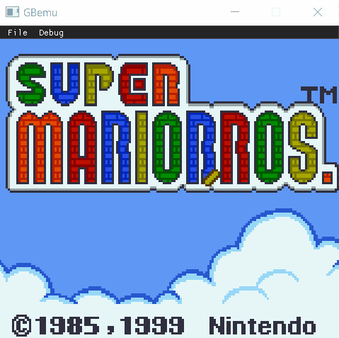
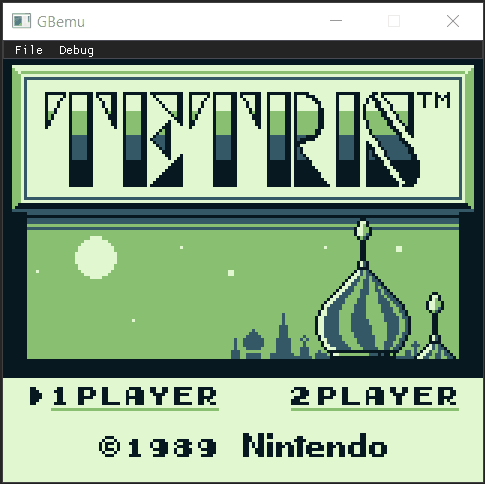
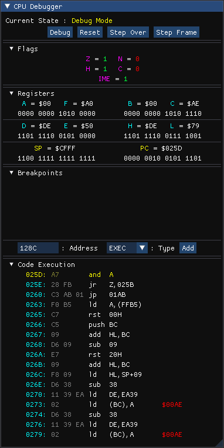

# GBemu

> An experimental Game Boy Emulator written in Java

| Game Boy Color | Game Boy |
|---|---|
|||
|||
|||
|||


---

## Table of Contents

- [Features](#features)
- [Screenshots](#screenshots)
- [Roadmap](#roadmap)
- [Known Issues](#known-issues)
- [Resources](#resources)
- [Libraries](#libraries)
- [License](#license)

---

## Features
### Core
* ```CPU``` Emulation with decompiler and debugger (with execution and memory breakpoints)
* ```PPU``` Emulation
* ```APU``` Emulation with 2 ```Pulse Channels```, a ```Wave Channel``` and a ```Noise Channel``` (no stereo output yet)
* Persistent ```RAM``` when supported by the cartridge
* Basics ```MBCs```:
    - [NoMBC](https://gbdev.io/pandocs/nombc.html)
    - [MBC1](https://gbdev.io/pandocs/MBC1.html) (Multigame Cartridges not supported yet)
    - [MBC2](https://gbdev.io/pandocs/MBC2.html)
    - [MBC3](https://gbdev.io/pandocs/MBC3.html) (RTC capability not tested yet)
    - [MBC5](https://gbdev.io/pandocs/MBC4.html)
    
### User Interface

#### Main Window
- Load a ROM
- Pause / Resume emulation
- Reset

#### Debug Window
- Enter step by step code execution
- Display flags and ```CPU registers``` (as 8bit and merge as 16bit)
- Display the current code execution

#### Memory Window
- Display one page of memory (256 bytes)
- Search for a specified address
- Display RAW memory as ASCII and hexadecimal
- Display ```RAM``` with color gradient to help spot patterns

#### PPU Window
- Display the 2 ```tilemaps``` and current viewport
- Display the ```tileset```
- Display ```OAM``` as list and as a rendered layer

#### APU Window
- Display waveforms of all Audio Channels and the master DAC

#### Serial Window
- Display the serial output of the Game Boy as a String

#### Console Window
- Display emulator information (Emulation reset, Breakpoint reached ...)
- Enabled user to enter commands (for now just 'help' and breakpoints)
  
---

## How to Use
### Launch
To launch the Emulator set the Main Class to ```Main.java```

!!! For now the current audio output is hardcoded at ```line 29```, you may need to change it !!!

---

## Screenshots
| CPU |
|-----|
||

| PPU |
|-----|
||

| APU |
|-----|
||


| I/O |
|-----|
||

---

## Roadmap
* [x] ```CPU``` implementation
* [x] ```Memory Management Unit``` implementation
* [x] OpenGL and ImGui layers
* [x] ```PPU``` implementation
* [x] ```Cartridge``` implementation
* [x] ```APU``` with all channels implementation
* [x] Debugger, PPU and APU visualization
* [x] Console and breakpoints
* [x] MBC1
* [x] MBC2
* [x] MBC3
* [x] MBC5
* [x] Game Boy Color features (WIP)
* [ ] Add more information to PPU Window when in CGB Mode (Palettes, Tilemaps Bank selection)
* [ ] Javadoc
* [ ] Input customization
---

## Known Issues

1) Pokémon Red and Blue run but render at half speed, even though audio run mostly as intended
2) Pokémon Yellow not booting at all, it loops reading screen registers ```LCDC or STAT```
3) Midframe ```X``` scrolling seams to be broken on CGB (At least in Zelda : Link's Awakening DX, it works but not for all ```y```, even though RAM value seems to be correct)
4) In Zelda : Link's Awakening DX, background gets corrupted when a textbox disappear, but gets back to normal when pause menu is invoked (Can be caused by faulty DMA impl. or it's caused by VRAM acces when PPU is reading it)
5) Game Boy Color Bootstrap display corrupted graphics, but loads fine, may be caused by DMA or HDMA transfers and can be related to ```4```, (need some digging)
--- 

## Resources
- **[GBDev Pan Docs](https://gbdev.io/pandocs/)** A very comprehensive documentation on the Game Boy's inner workings
- **[Gameboy CPU Manual](http://marc.rawer.de/Gameboy/Docs/GBCPUman.pdf)** A complete document explaining the CPU's inner workings (opcodes, timing, registers ...)
- **[gbops](https://izik1.github.io/gbops/)** A list of the opcodes of the Gameboy's custom CPU
- **[Gameboy OPCODES](https://www.pastraiser.com/cpu/gameboy/gameboy_opcodes.html)** Another list of the opcodes of the Game Boy's custom CPU, known to have some mistakes regarding some instruction sizes
---

## Libraries
- **[LWJGL 3](https://www.lwjgl.org/)** : OpenGL Wrapper for Java (and other useful utilities)
- **[Beads](http://www.beadsproject.net/)** : Audio library used for generating waveforms
- **[ImGui-Java](https://github.com/SpaiR/imgui-java)** : **[Dear ImGui](https://github.com/ocornut/imgui)** wrapper for Java
---

## License

This project is licensed under the **[MIT license](http://opensource.org/licenses/mit-license.php)**
