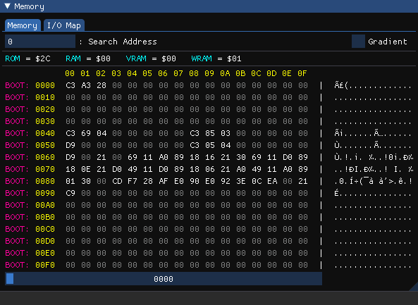
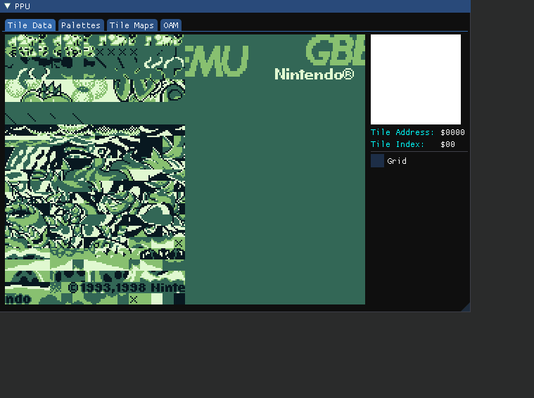

# GBemu

> An experimental Game Boy Emulator written in Java

<p align="center">
  
</p>

| Game Boy Color | Game Boy |
|---|---|
|||
|||
|||
<p align="center">
  
</p>


---

## Table of Contents

- [Features](#features)
- [Screenshots](#screenshots)
- [Roadmap](#roadmap)
- [Known Issues](#known-issues)
- [Resources](#resources)
- [Libraries](#libraries)
- [License](#license)

---

## Features
### Core
* ```CPU``` Emulation with decompiler and debugger (with execution and memory breakpoints)
* ```PPU``` Emulation
* ```APU``` Emulation with 2 ```Pulse Channels```, a ```Wave Channel``` and a ```Noise Channel``` (no stereo output yet)
* Persistent ```RAM``` when supported by the cartridge
* Basics ```MBCs```:
    - [NoMBC](https://gbdev.io/pandocs/nombc.html)
    - [MBC1](https://gbdev.io/pandocs/MBC1.html) (Multigame Cartridges not supported yet)
    - [MBC2](https://gbdev.io/pandocs/MBC2.html)
    - [MBC3](https://gbdev.io/pandocs/MBC3.html) (RTC capability not tested yet)
    - [MBC5](https://gbdev.io/pandocs/MBC4.html)
    
### User Interface

#### Main Window
- Load a ROM
- Pause / Resume emulation
- Reset

#### Settings Window
- Change emulation speed
- Enable / Disable RTC
- Enable / Disable Bootstrap
- Specify Bootstrap ROMs (for DMG and CGB)
- Edit Gamma factor for color correction (Only in CGB Mode)
- Select an existing DMG palette or customize it yourself
- Choose audio output
- Change master volume
- Enable / Disable audio channels

#### GameShark Window
- Enable/Disable cheats
- Add/Remove cheats

#### Debug Window
- Enter step by step code execution
- Display flags and ```CPU registers``` (as 8bit and merge as 16bit)
- Display the current code execution
- Manage breakpoints (Execution, Memory access ...)

#### Memory Window
- Display one page of memory (256 bytes)
- Search for a specified address
- Display RAW memory as ASCII and hexadecimal
- Display which sector a RAM address belongs to
- Display ```RAM``` with color gradient to help spot patterns
- Display a formatted view of the I/O registers

#### PPU Window
- Display the ```tilemaps``` and current viewport and tile information
- Display the ```tileset``` with tile information
- Display the ```palettes``` with color details
- Display ```OAM``` as list and as a rendered layer

#### APU Window
- Display waveforms of all Audio Channels and the master DAC
- Display the state of the Audio Registers and the Wave data

#### Serial Window
- Display the serial output of the Game Boy as a String

#### Console Window
- Display emulator information (Emulation reset, Breakpoint reached ...)
- Enabled user to enter commands (for now just 'help' and breakpoints)
  
#### Multithreading
Each of the following features run on a dedicated thread :
- Gameboy core hardware (CPU, APU, PPU, MMU, Timers, Cartridge)
- Windows rendering routines (Screen rendering, ImGui Layers, Input capture, Console command (Forwarded to the Console Thread))
- Debugger (CPU and MMU snapshots, breakpoint system, PPU Debug rendering, APU Visualizer and Serial Output)
- Console interpreter
---

## How to Use
### Launch
To launch the Emulator set the Main Class to ```Main.java```

!!! For now the current audio output is hardcoded at ```line 29```, you may need to change it !!!

---

## Screenshots
<p align="center">
  
</p>
<p align="center">
  
</p>
<p align="center">
  
</p>
<p align="center">
  
</p>
<p align="center">
  
</p>
<p align="center">
  
</p>
<p align="center">
  
</p>
<p align="center">
  
</p>

---

## Roadmap
* [x] ```CPU``` implementation
* [x] ```Memory Management Unit``` implementation
* [x] OpenGL and ImGui layers
* [x] ```PPU``` implementation
* [x] ```Cartridge``` implementation
* [x] ```APU``` with all channels implementation
* [x] Debugger, PPU and APU visualization
* [x] Console and breakpoints
* [x] MBC1
* [x] MBC2
* [x] MBC3
* [x] MBC5
* [x] Game Boy Color features
* [x] Settings pannel (Inputs, Audio, Graphics ...)
* [x] Multithreading
* [x] GameShark cheats
* [ ] Input customization
* [ ] Javadoc

---

## Known Issues

1) Pokémon Red and Blue run but render at half speed, even though audio run mostly as intended
2) Pokémon Yellow not booting at all, it loops reading screen registers ```LCDC or STAT```
--- 

## Resources
- **[GBDev Pan Docs](https://gbdev.io/pandocs/)** A very comprehensive documentation on the Game Boy's inner workings
- **[Gameboy CPU Manual](http://marc.rawer.de/Gameboy/Docs/GBCPUman.pdf)** A complete document explaining the CPU's inner workings (opcodes, timing, registers ...)
- **[gbops](https://izik1.github.io/gbops/)** A list of the opcodes of the Gameboy's custom CPU
- **[Gameboy OPCODES](https://www.pastraiser.com/cpu/gameboy/gameboy_opcodes.html)** Another list of the opcodes of the Game Boy's custom CPU, known to have some mistakes regarding some instruction sizes
---

## Libraries
- **[LWJGL 3](https://www.lwjgl.org/)** : OpenGL Wrapper for Java (and other useful utilities)
- **[Beads](http://www.beadsproject.net/)** : Audio library used for generating waveforms
- **[ImGui-Java](https://github.com/SpaiR/imgui-java)** : **[Dear ImGui](https://github.com/ocornut/imgui)** wrapper for Java
---

## License

This project is licensed under the **[MIT license](http://opensource.org/licenses/mit-license.php)**
